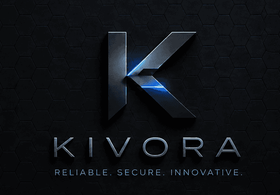

<p align="center">
  
</p>

<p align="center">
  Самостоятельно размещаемый мессенджер со сквозным шифрованием и
  <b>подключаемыми шифрами</b>.<br />
  Не форк Telegram и не форк Mattermost: собственный сервер, собственный
  протокол, собственный клиент.
</p>

---

* **Сервер** — один статический бинарник (~7 МБ) без единой сторонней
  зависимости. Внутри него уже лежит веб-клиент. Запускается на чём угодно, от
  VPS за 3 доллара до Raspberry Pi.
* **Шифрование** — сменное. Свой алгоритм добавляется реализацией одного
  интерфейса из девяти методов, и для каждого чата можно выбрать свой набор.
* **Клиенты** — Windows 10/11, Linux (Tauri) и веб. Один и тот же код интерфейса.
* **Языки** — русский и английский, определяется по системе.
* **Лицензия** — Apache 2.0. Открыто целиком, включая криптографию.

```
┌──────────┬───────────────────────┬──────────────────────────────────────┐
│  рельса  │      список чатов     │              переписка               │
│ логотип= │  (плотный, как в TG,  │   пузыри, фото и видео, закреплённые │
│ домой,   │   с меню из 3 точек)  │   сообщения, звонки, ветки, сверка   │
│ каналы,  │                       │   ключей — как в Telegram, каналы и  │
│ архив,   │                       │   участники — как в Mattermost       │
│ админка  │                       │                                      │
└──────────┴───────────────────────┴──────────────────────────────────────┘
```

## Быстрый старт

Нужны Go 1.24+ и Node 20+.

```powershell
.\build.ps1 -Run                  # Windows
```

```sh
./build.sh run                    # Linux и macOS
```

Откройте `http://localhost:8080`, зарегистрируйтесь — **первый созданный аккаунт
становится администратором сервера**. Всё: чат работает, сообщения шифруются на
устройстве.

Хотите просто попробовать, не устанавливая Go и Node — Releases: «готовые сборки — на странице Releases».

### Команды сборки

| Windows                     | Linux / macOS        | Что делает                                        |
| --------------------------- | -------------------- | ------------------------------------------------- |
| `.\build.ps1`               | `./build.sh`         | Веб-клиент + сервер в один бинарник `dist/kivorad` |
| `.\build.ps1 -Run`          | `./build.sh run`     | То же самое и сразу запустить                      |
| `.\build.ps1 -Task desktop` | `./build.sh desktop` | Приложение для текущей платформы (нужен Rust)      |
| `.\build.ps1 -Task test`    | `./build.sh test`    | Тесты Go, тесты криптографии, проверка типов        |
| `.\build.ps1 -Task release` | `./build.sh release` | Бинарники под linux/windows/macos, amd64/arm64      |
| `.\build.ps1 -Task package` | `./build.sh package` | Три готовые поставки: сервер, Windows, Linux         |
| `.\build.ps1 -Task brand`   | `./build.sh brand`   | Пересобрать логотипы и иконки из `brand-source/`    |

Есть и Makefile — он лежит как `build.mk`: `make -f build.mk server`.

## Что умеет

**Переписка.** Личные чаты, закрытые группы и открытые каналы. Ответы на
сообщения, закрепление, удаление у всех, поиск по чатам, непрочитанные,
индикатор набора текста, статусы «в сети».

**Смайлы, фото и видео.** Панель эмодзи с категориями, поиском и недавними —
без единой сторонней библиотеки. Изображения и видео шифруются на устройстве
собственным одноразовым ключом, который едет **внутри** зашифрованного
сообщения; сервер хранит только шифротекст. Превью размывается до загрузки,
полноэкранный просмотрщик листает вложения стрелками.

**Звонки.** Один на один и групповые, аудио и видео, демонстрация экрана.
WebRTC-меш: медиа идёт напрямую между участниками, сервер передаёт только
сигналинг. Каждый звонок показывает **код звонка** — четыре группы цифр из
отпечатков DTLS: назвали друг другу, совпало — посередине никого нет. Отказ
доходит до звонящего, дозвон сам прекращается через 45 секунд, на видеозвонок
можно ответить без камеры.

**Исчезающие сообщения.** Таймер на чат — час, сутки, неделя, месяц — плюс
общий предел хранения на установке (`KIVORA_RETENTION_DAYS`). Побеждает более
ранний срок. Истечение не прячет сообщение, а уничтожает завёрнутые ключи, так
что оно нечитаемо и для того, у кого осталась старая копия файла блобов.

**Ветки в группах.** Ветка живёт внутри группы, но со своим ключом и своим
списком участников: тот, кого не добавили, не просто не видит её в списке — ему
никогда не заворачивали ключ, и шифротекст для него так же непроницаем, как для
постороннего.

**Проверка ключей.** Код безопасности, который обе стороны видят одинаковым,
отметка «проверено», предупреждение при смене ключа собеседника и отпечатки
каждого устройства.

**Управление шифрованием.** Экран со всеми доступными наборами, выбор основного,
выбор набора при создании конкретного чата и инструкция, как добавить свой.

**Аватары.** Для пользователей и для групп: изображение пережимается в 256px
WebP на устройстве — это заодно срезает EXIF с геометкой и моделью камеры.

**Действия с чатом** через три точки: закрепить, заглушить, в архив, отметить
прочитанным, **скачать архив переписки** (расшифрованный JSON), очистить свои
сообщения, покинуть чат.

**Админ-консоль** — отдельная страница по адресу `/admin`, а не вкладка внутри
мессенджера: своя тёмная боковая панель с разделами, строка поиска, хлебные
крошки, градиентные плитки со статистикой, активность за неделю, таблицы
пользователей и каналов. Содержимого сообщений там нет и быть не может.
Отдельный раздел «Страницы» позволяет заранее посмотреть на страницу 404 и
проверить, каким кодом отвечает сервер на несуществующий адрес.

**Страница 404** — анимированная, с крутящимися шестернями; та же картинка
живёт отдельным самодостаточным файлом для обратного прокси, чтобы работать,
когда приложение недоступно.

## Три поставки

`./build.sh package` собирает не одну папку, а три — потому что скачивают их
три разных человека, и каждому не надо читать чужие две трети:

| Поставка | Кому | Что внутри |
| -------- | ---- | ---------- |
| `kivora-server-<версия>` | Тому, кто ставит на сервер | Бинарники amd64 и arm64, `install.sh` для systemd, конфиги Caddy/nginx/Docker, страница 404 для прокси, DEPLOY и CORE-PROTECTION |
| `kivora-windows-<версия>` | Пользователю Windows 10/11 | `kivora.exe`, запуск двойным кликом, инструкция про SmartScreen и брандмауэр |
| `kivora-linux-<версия>` | Пользователю Linux | Бинарники x86-64 и ARM, автозапуск через пользовательский systemd |

Рядом кладётся `SHA256SUMS.txt`.

## Что внутри

| Каталог                  | Что это                                                            |
| ------------------------ | ------------------------------------------------------------------ |
| `server/`                | Go-сервер: API, реальное время, хранилище, встроенный веб-клиент     |
| `server/internal/crypto` | Argon2id и BLAKE2b — свои, сверены с тест-векторами RFC              |
| `server/internal/ws`     | WebSocket по RFC 6455 — свой, чтобы не тащить зависимость            |
| `server/internal/store`  | Хранилище: журнал только на дозапись + индексы в памяти              |
| `packages/kivora-crypto` | Криптоядро клиента: X25519, Ed25519, XChaCha20-Poly1305, конверт     |
| `web/`                   | Веб-клиент на React + Vite, локализация, сквозной браузерный тест    |
| `desktop/`               | Оболочка Tauri и защищённое ядро на Rust                            |
| `brand-source/`          | Исходные изображения логотипа, из которых собираются все иконки      |
| `docs/`                  | Архитектура, криптография, защита ядра, вес, развёртывание, API       |
| `prebuilt/`              | Готовый сервер для Windows и Linux — попробовать без установки Go    |

## Исходные требования и что с ними стало

**Первый заход**

1. **Свои методы шифрования** → интерфейс `CipherSuite` (девять методов) и реестр
   с версионированием. Работающий пример стороннего набора — в тестах,
   пошаговая инструкция — в [docs/CRYPTO.md](docs/CRYPTO.md).
2. **Открытый исходный код** → Apache 2.0, ни одной сторонней зависимости на
   сервере.
3. **Визуал Telegram + Mattermost** → рельса и открытые каналы от Mattermost,
   плотный список чатов и пузыри от Telegram. Тёмная и светлая темы.
4. **Гибкость и запуск где угодно** → один бинарник без cgo, вся настройка
   переменными окружения. См. [docs/DEPLOY.md](docs/DEPLOY.md).
5. **Уменьшение веса** → разбор с измерениями в
   [docs/LIGHTWEIGHT.md](docs/LIGHTWEIGHT.md).
6. **Windows 10/11 и Linux** → Tauri: системный WebView вместо своего Chromium.
7. **Простой веб и регистрация в обоих** → один и тот же экран входа.
8. **Защита ядра приложения** → [docs/CORE-PROTECTION.md](docs/CORE-PROTECTION.md).

**Второй заход**

9.  **Смайлы, фото, видео** → панель эмодзи без зависимостей, зашифрованные
    вложения с превью и просмотрщиком.
10. **Звонки и групповые звонки** → WebRTC-меш, сигналинг через сервер, экран
    звонка с сеткой участников и демонстрацией экрана.
11. **Иконки пользователей и групп** → аватары с пережатием и очисткой метаданных.
12. **Понятная смена шифров + несколько сразу** → экран наборов в настройках,
    выбор набора для каждого чата отдельно.
13. **Проверка ключей** → коды безопасности, отметка «проверено», тревога при
    смене ключа.
14. **Логотип возвращает к чатам** → кнопка-логотип в углу рельсы.
15. **Автоматическая привязка к языку** → определение по системе, ручное
    переопределение в настройках и на экране входа.
16. **Архив и быстрые действия через три точки** → меню у каждого чата.
17. **Закрепление сообщений** → панель закреплённых с переходом к сообщению.
18. **Ветки с отдельным шифрованием** → подканалы со своим ключом и составом.
19. **Админ-панель** → дашборд со статистикой, таблицами и политиками.
20. **Название Kivora** → переименовано целиком, включая идентификаторы шифров.
21. **Логотипы** → иконка, маленькая иконка и большое лого разведены по местам,
    все производные собираются скриптом.
22. **Страница 404** → анимированная, в приложении и отдельной страницей для
    обратного прокси.
23. **Иконка во вкладке браузера** → favicon, apple-touch-icon и веб-манифест.

## Как это работает, в двух абзацах

Каждая установка — это «устройство» со своей долговременной парой ключей.
Сообщение шифруется один раз случайным ключом содержимого, а сам ключ
заворачивается отдельно **для каждого устройства каждого участника** через два
Диффи-Хеллмана: эфемерный (даёт прямую секретность) и статический ключ
отправителя (даёт аутентификацию). Вложения получают свой одноразовый ключ,
который лежит внутри того же зашифрованного сообщения. Сервер хранит шифротекст
и завёрнутые ключи и не может открыть ни то, ни другое.

Сервер при этом не бесполезен: он раздаёт открытые ключи, следит, чтобы ключ
нельзя было завернуть для устройства не из чата, ограничивает частоту запросов,
хранит историю, передаёт сигналинг звонков и рассылает события. Но всё, что он
видит, — это метаданные и непрозрачные байты. Подробности — в
[docs/ARCHITECTURE.md](docs/ARCHITECTURE.md).

## Проверено, а не заявлено

`./build.sh test` — тесты Go и криптографии. `node web/e2e/smoke.mjs` — сквозной
сценарий в настоящем браузере.

* **Криптопримитивы против официальных тест-векторов.** Argon2id — RFC 9106 §5.3,
  BLAKE2b — RFC 7693, SHA-256/HMAC/HKDF — NIST и RFC 5869, ChaCha20-Poly1305 —
  RFC 8439, X25519 — RFC 7748, Ed25519 — RFC 8032.
* **Свойства протокола.** Посторонний с шифротекстом не читает; подмена
  отправителя отвергается; сообщение нельзя переиграть в другом чате;
  подменённый сервером предключ не проходит проверку подписи; устройство на
  другом наборе шифров пропускается, а не понижает шифрование остальным; ключ
  файла не появляется рядом с шифротекстом.
* **Права доступа на сервере.** Посторонний не скачает вложение и не загрузит его
  в чужой чат; сообщение не может «усыновить» файл из другого чата; чужой аватар
  нельзя надеть; участник группы вне ветки её не видит; обычный аккаунт получает
  403 от админского API; последнего администратора нельзя разжаловать.
* **Хранилище.** Обрыв записи на середине не ломает базу, уплотнение не теряет
  данные, параллельные отправки не дублируют номера.
* **Сквозной сценарий в браузере.** Три пользователя регистрируются, переписка и
  фото доходят в реальном времени и расшифровываются, коды безопасности
  совпадают, закрепление видно обеим сторонам, ветка недоступна лишнему
  участнику, звонок доходит и отказ возвращается звонящему, английский браузер
  получает английский интерфейс, а в том, что реально лежит на сервере,
  открытого текста нет.

## Что ещё не сделано

Честный список, чтобы не было сюрпризов:

* Медиа в звонках защищено DTLS-SRTP между участниками, но сквозного шифрования
  поверх него пока нет — на групповых звонках это станет важно, когда появится
  SFU. Сейчас используется меш, поэтому сервер и так не участник разговора.
* Звонки в Linux-сборке десктопа упираются в разрешения WebKitGTK; на Windows
  работают, в браузере работают везде. Подробности — в конце `desktop/src-tauri/src/lib.rs`.
* Двойной храповик (Double Ratchet) не реализован: прямая секретность даётся
  эфемерным ключом на сообщение, но полного post-compromise recovery нет.
* Аватары хранятся на сервере в открытом виде — это осознанный компромисс,
  объяснённый в [docs/CRYPTO.md](docs/CRYPTO.md).
* Мобильных приложений нет (веб-версия на телефоне работает).
* Push-уведомлений нет — они требуют посредника, а это отдельное решение о
  метаданных.

## Документация

* [docs/ARCHITECTURE.md](docs/ARCHITECTURE.md) — из чего состоит и почему
* [docs/CRYPTO.md](docs/CRYPTO.md) — протокол и как добавить свой шифр
* [docs/CORE-PROTECTION.md](docs/CORE-PROTECTION.md) — защита ядра и модель угроз
* [docs/LIGHTWEIGHT.md](docs/LIGHTWEIGHT.md) — вес: измерения и что ещё можно снять
* [docs/DEPLOY.md](docs/DEPLOY.md) — развёртывание, настройки, обновление
* [docs/API.md](docs/API.md) — HTTP и WebSocket
* [docs/THREAT-ROADMAP.md](docs/THREAT-ROADMAP.md) — звонки, метаданные и что делать дальше

## Лицензия

Apache License 2.0 — см. [LICENSE](LICENSE).
